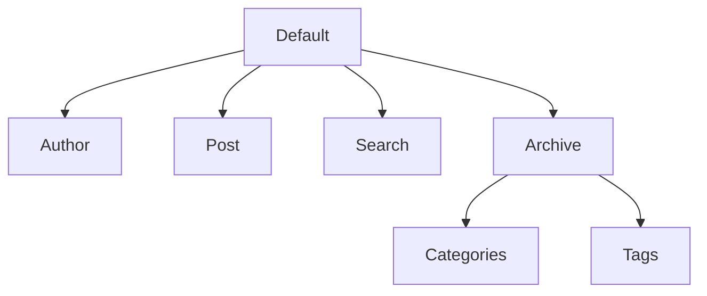

Recently, I created a blog theme for Jekyll called [Lined Paper](https://iangge.github.io/lined-paper/) after being inspired by this site's theme, Chirpy. When following [Jekyll's step-by-step tutorial](https://jekyllrb.com/docs/step-by-step/01-setup/), I noticed it mentioned how layouts in Jekyll use inheritance. 

> **Inheritance** is one of the core features of object-oriented programming. It’s a programming procedure that allows you to reuse code by referencing the behaviors and data of an object.

([Codecadamey](https://www.codecademy.com/resources/blog/what-is-inheritance/), 2023)

I remembered this concept when I took a Java class at my community college, so it was nice to run into it again when making a Jekyll theme.

For Jekyll themes, "inheritance is useful when you want to add something to an existing layout" ([Jekyll Docs](https://jekyllrb.com/docs/layouts/#inheritance)). In my case, I wanted the same sidebar navigation on every page of my Jekyll theme, so I needed to use inheritance to ensure every layout stemmed from the default one with the sidebar. 

<!-- Note to self: html code does not work in code blocks -->

I also wanted a way to visualize the inheritance of my layouts, so I asked the [Jekyll Talk forums](https://talk.jekyllrb.com/t/tools-for-visualizing-layout-inheritance/9683) and they suggested using a Mermaid diagram. 

## Mermaid Diagram

[Mermaid diagrams](https://mermaid.js.org/intro/) are helpful since they allow you to create charts using Markdown, plus they're compatible with many Jekyll themes, including Chirpy. Below is the flowchart I made to visualize the layouts in [this folder](https://github.com/iangge/lined-paper/tree/main/_layouts). 

I opted for a top-down flowchart to somewhat mimic a UML diagram. However, it's not a full on UML diagram because the classes do not have attributes or methods. Still, it's useful for seeing how the different layouts are related to one another. 

## Future Considerations - Generator Plugin

Another user on the same forum topic suggested making a [generator plugin](https://jekyllrb.com/docs/plugins/generators/) to extract the layouts information. Perhaps that plugin could be used to automatically display the layouts in a Mermaid diagram. I think that could be an interesting future project to work on for learning about plugins. 

Overall, I'm glad to have gotten the practice with Mermaid diagrams and Jekyll layout inheritance. Special thank you to users george-gca and jeffque for their suggestions on the Jekyll Talk forums. 